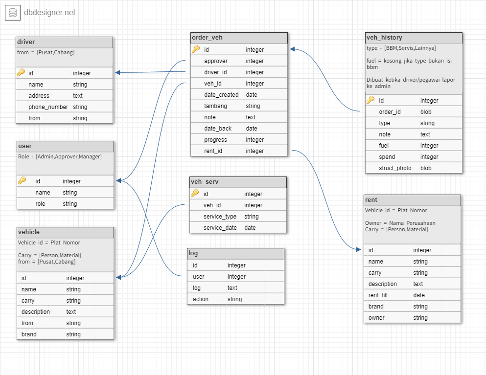

### User admin
    - username/email = admin@gmail.com
    - password = password
### User Penyetuju
    - username/email = penyetuju@gmail.com
    - password = password
### User Manajer
    - username/email = manajer@gmail.com
    - password = password

## Framework = Laravel
## DB dan PHP = Xampp 3.3.0
    - DB [Ver 15.1 Distrib 10.4.19-MariaDB]
    - PHP 8.0.7
### Data:
    - import db.sql 
    atau
    - migrate laravel

### Flow Sederhana
    - Login
    - Admin Melakukan Pesan Kendaraan
    - Lalu akan masuk di laporan pesanan untuk menerima request dari user sesuai role
    - Persetujuan berjenjang dari Admin -> Penyetuju -> Manajer

### Mohon maaf jika ada kekurangan, mungkin masih ada fitur-fitur kecil yang belum selesai 
